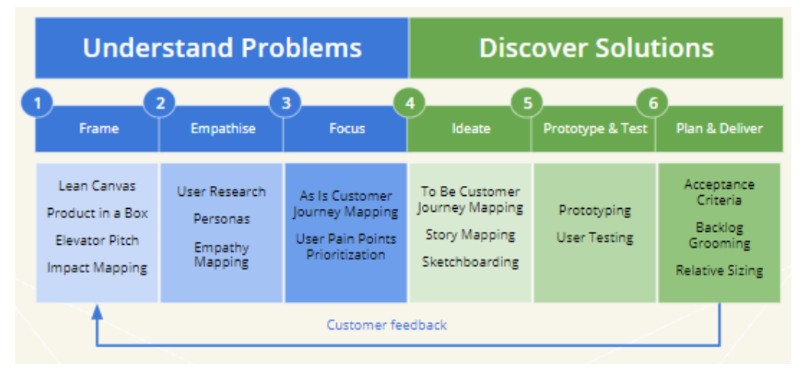

### Определение 
**Agile**  —  модель  разработки  ПО,  ориентированная  на  использование итеративной разработки, динамическое формирование требований и их реализацию в самоорганизующейся группе.
Agile основан на *ценностях* и *принципах*, которые зафиксированы в [agile manifesto](../../agile%20manifesto.md) разработанном в 2001 году.

### Ценности
- Люди 
- Работающее ПО
- Сотрудничество
- Реагирование на изменение

### Принципы
1. Удовлетворение потребностей клиентов
2. Меняющиеся требования
3. Доставка ПО максимально часто
4. Команда и заказчик работают вместе
5. Доверяй мотивированным людям
6. Беседуй лицом к лицу
7. Работающее ПО - мерило прогресса
8. Устойчивое развитие и постоянный темп
9. Внимание к техническому совершенству
10. минимизации лишней работы
11. самоорганизующимися командами
12. команда регулярно размышляет как стать эффективнее

 see *↪* [agile manifesto](../../agile%20manifesto.md#Принципы-Agile) 

###  Frameworks

В  рамках  гибкой  модели  разработки  существуют  ряд   фреймворков,  которые придерживаются  принципов Agile. Некоторые из них: 
- [`Scrum`](../../скрам%20на%20проектах.md)
- [ LeSS (Large Scale Scrum)](https://less.works/less/framework/index.html)
- [ SAFe (scaled agile framework) ](https://www.scaledagileframework.com/)
- [`Kanban`](../../`Kanban`.md)
- Extreme Programming (XP)
- Lean (бережливая разработка ПО)

## AGILE АНАЛИЗ

### 7 принципов анализа для BA: 

- **See the whole** (цельный взгляд) 
	- необходимо рассматривать проблемы, возможности, и ценность для заинтересованных лиц в конкретном контексте. Изменение контекста должно быть учтено при определении ценности.
- **Stimulate collaboration and continuous improvement** (сотрудничество и постоянное совершенствование)
	- качество требований к ПО обеспечивается на основе совместной командной работы
- **Understand what is doable** (Понять, что можно сделать) 
	- необходим оптимальный баланс между усилием на реализацию и ценностью для заинтересованных лиц. 
- **Think as a customer** (Думайте как клиент)
	-  в  основе  разработки требований.  должны лежать ожидания, потребности и ценности заказчика
- **Analyze to determine what is valuable** (анализируйте, что ценно сейчас)
	- непрерывная оценка и приоритизация ценности каждого  элемента  бэклога  в  целях  поставки  наиболее  важных  на текущий момент функций. 
- **Get  real  using examples**  (Используйте примеры)
	- валидность  потребности  заинтересованных  лиц  должна  быть подтверждена при помощи реальных примеров. 
- **Avoid waste** (Избегайте отходов)
	- усилия на каждом этапе должны быть целесообразны и минимальны для достижения необходимого результата. 
	- этот принцип реализован в виде легковесной проектной документации и  декомпозиции [`User Story`](../../`User%20Story`.md) только в верхней, наиболее приоритетной части [`Backlog`](../../`Backlog`.md). 

### Особенности бизнес-анализа в Agile

- **Облегченная документация** 
	- подробная  документация  с  требованиями  и техническими  деталями  решения  не  требуется.  Основным  артефактом,  содержащим требования, является 
- **Артефакты  Agile**
	- бизнес-аналитик  создает  и поддерживает [`Backlog`](../../`Backlog`.md) включающий в себя [`Epic`](../../`Epic`.md) и [`User Story`](../../`User%20Story`.md) с  [`Acceptance Criteria`](../../`Acceptance%20Criteria`.md) 
	- Помимо этого, он может создавать [`Impact Mapping`](../../`Impact%20Mapping`.md) , [`Personas`](../../`Personas`.md), [`Story Mapping`](../../`Story%20Mapping`.md) , а  также сопровождать  требования  визуальными  моделями  и [`Prototyping`](../../`Prototyping`.md). 
	- Спецификации требований редко используются в agile. 
- **Фокус  на  конечном  пользователе**
	- большинство  артефактов за основу берут нужды и задачи пользователя
	- Именно этот подход положен в основу декомпозиции и приоритизации требований. 
- **Итеративность** разработки требований
	- бизнес-аналитик детализирует самые приоритетные элементы бэклога, необходимые для формирования скоупа ближайшего спринта. 
- **Адаптивность** 
	- основным  двигателем   является обратная  связь  от  заказчика.  
	- бизнес- аналитик сконцентрирован на сборе обратной связи и адаптивно вносит изменения в бэклог 
	- вместо  того,  чтобы заранее  упреждающе предсказывать  изменения  в  требованиях
- **Оптимальность  декомпозиции**  
	- требования  должны  быть  оптимально декомпозированы  на [`User Story`](../../`User%20Story`.md) и [`Epic`](../../`Epic`.md)  для:
		- краткосрочного  планирования, 
		- приоритизации, 
		- итеративной  реализации, 
		- поставки наименьшего инкремента как можно чаще.  
- **Совместная  работа  над  требованиями**  
	- требования  детализируются  в процессе совместной работы над [`Backlog`](../../`Backlog`.md) всей командой. Это позволяет спроектировать оптимальное решение и обеспечить качество
- **Участие в agile церемониях** 
	- на проекте [`Scrum`](../../скрам%20на%20проектах.md) бизнес-аналитик это ключевой участник [`Backlog grooming`](../../`Backlog%20grooming`.md) планинга и [Sprint Review](../../Sprint%20Review.md) а также активно участвует в [Daily scrum](../../Daily%20scrum.md) и [`Retrospective`](../../`Retrospective`.md) 

### Практики бизнес-анализа
- Процесс работы с требованиями итеративен и повторяется несколько раз по мере продвижения команды в разработке продукта. 
- В зависимости от сложности и размера проекта бизнес-аналитик выбирает необходимые практики . Наиболее популярные их них:
	- [`Lean  Canvas`](../../`Lean%20%20Canvas`.md) 
	- [`Impact Mapping`](../../`Impact%20Mapping`.md)
	- [`Personas`](../../`Personas`.md)
	- [`Story Mapping`](../../`Story%20Mapping`.md)
	- [`User Story`](../../`User%20Story`.md)
	- [`Epic`](../../`Epic`.md)
	- [`Acceptance Criteria`](../../`Acceptance%20Criteria`.md)
	- [Backlog Maintenance (Поддержание бэклога)](../../Backlog%20Maintenance_Поддержание%20бэклога.md)

## Что такое Scrum and Kanban

see *↪* [`Scrum`](../../скрам%20на%20проектах.md)

see *↪* [`Kanban`](../../`Kanban`.md)

> [!abstract]- metadata
> Type:: #newspaper 
> Status:: #done
> Location:: #office
> Project:: [0_Business Analyst `BA`](../../0_Business%20Analyst%20`BA`.md)
> Topic:: project management, methodologies, principles
> Back link::
> Source:: 

